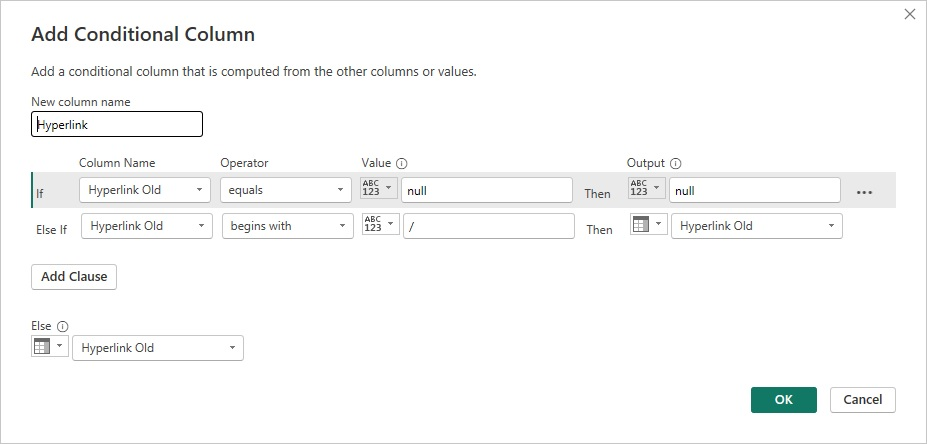
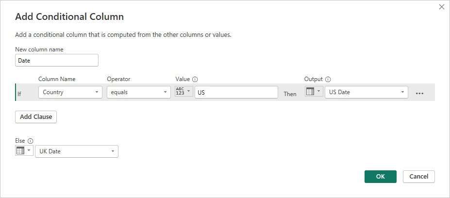

# Lab 2 - Datapreparatie uitdagingen

*Vereisten*

Om het lab te kunnen starten is het van belang dat je toegang hebt tot Power BI desktop.

*Doel*

In dit tweede lab leer je Power Query in te zetten om basale uitdagingen in datapreparatie op te lossen.

## Opdracht 1 - Betekenis halen uit gecodeerde kolommen

1. Start een nieuw Power BI rapport en lees workbook **L2O1.xlsx** uit **Lab 2** in als Excel workbook.

2. Selecteer in het **Navigator** scherm dat opent de tabellen **Categories**, **Colors** en **Products** en selecteer **Transform Data**. Check dat je in het *Queries* paneel dat opent de drie queries kan zien en bekijk de preview.

3. Selecteer de **Categories** query en merk op dat de eerste rij de kolomkoppen bevat. Selecteer in de tab **Transform** de transformatie **Use First Row as Headers** om dit op te lossen. Werk je liever met shortcuts dan kun je ook in het *Preview* paneel in de linkerbovenhoek op het tabelicoontje klikken en vervolgens **Use First Row as Headers** selecteren.

4. Herhaal stap 3 voor de **Colors** query.

5. Selecteer in de **Products** query de **Product Code** kolom door op de kolomkop te klikken of door onder de **Home** tab onder het dropdown menu **Choose columns** de optie **Go to Column** te selecteren en de kolom **Product Code** te kiezen.

6. Selecteer onder de **Transform** tab het dropdown menu **Split Column** en selecteer **By Delimiter**. Hetzelfde kun je doen door te rechtsklikken op de kolomkop **Product Number** en vervolgens **Split Column** en **By Delimiter** te kiezen.

7. De default instellingen zijn correct voor het splitsen van deze kolom, maar check voor je **OK** drukt nog even de instellingen. 
	- De **Custom** optie is geselecteerd en het streepje als scheidingsteken. Power Query heeft dit goed beoordeeld op basis van de waarden in de kolom.
	- **Each occurence of this delimiter** is geselecteerd omdat er meerdere scheidingstekens zijn gevonden per waarde.
	- Als je de Advanced options openklapt, zie je dat Power Query heeft gedetecteerd dat de waarde van **Product Number** in vier kolommen kan worden gesplitst.
	- Het **Quote Character** is ook ingesteld. Scheidingstekens (in dit geval streepje) die deel zijn van een tekst en niet als scheidingstekens moeten worden behandeld kunnen met de **Quote Character** correct worden geïnterpreteerd.
	
8. Na het sluiten van de dialoog zie je de vier nieuwe kolommen (Product Number.1 t/m 4)in het *Preview* paneel. Hernoem ze tot **Category Code**, **Short Product Number**, **Size** en **Color**. 

## Opdracht 2 - Samenvoegen van tabellen

In Opdracht 1 hebben we de codes voor Category en Color geëxtraheerd uit een samengestelde kolom. In deze opdracht geven we hier vervolg aan door de codes te vervangen door de omschrijvingen.

1. Selecteer de **Products** query en kies onder de **Home** tab voor **Merge Queries**. 

> In de **Merge** dialoog die opent kun je twee tabellen samenvoegen op basis van overeenkomende waarden in gespecificeerde kolommen. We gaan de **Product Category Name** uit de **Categories** query opnemen in de **Products** query, aan de hand van de overeenkomende **Category Code**.

2. Selecteer de **Category Code** in de **Products** tabel en selecteer in het dropdown menu **Categories**. Selecteer daarin ook **Category Code**. Check dat in de **Join Kind** gekozen is voor **Left Outer (All from first, matching from second)** en klik op OK.

> In het *Preview* paneel is een nieuwe **Categories** kolom toegevoegd met tabelobjecten als waarden.

3. **Expand** de kolom door in de kolom op de twee pijltjes te klikken. Verwijder in de **Expand** dialoog de vinkjes voor **Category Code** en **Use original column name as prefix** en klik op OK. De **Categories** kolom is vervangen door een nieuwe kolom **Product Category Name** met de overeenkomende waarden in elke rij.

4. Nu je de **Product Category Name** ter beschikking hebt, kun je de **Category Code** verwijderen door de kolom te selecteren en op de Delete toets te drukken.

> Hoewel de **Category Code** kolom nodig was om de Product en Categories queries samen te voegen, kan het resultaat van die stap gezien worden als een tijdelijke tabel, waarin de kolom overbodig is geworden.

5. Herhaal stap 1 t/m 4 voor het opnemen van kolom **Color** uit de **Colors** query in de **Products** query.

> Nu we de inhoud van de **Categories** en **Colors** queries hebben overgenomen zijn de queries overbodig geworden en hoeven ze niet meer te worden geladen.

6. Rechtsklik in het *Queries* paneel op de **Categories** query en verwijder het vinkje **Enable Load**. Herhaal dit voor de **Colors** query.

> Stap 6 stelt je in staat queries als opstapjes te gebruiken voor andere queries en zorgt ervoor dat ze niet in het Power BI rapport worden geladen.

7. Op het **Home** tab, klik op **Close & Apply**. Maak ter verificatie een column chart met **Color** op de X-as en een count van **Product** op de Y-as.

## Opdracht 3 - Kolommen uit voorbeelden

Het belang van een functie is vaak af te lezen uit de positie in het lint. In de **Add Column** tab staat **Column from Examples** helemaal links. Het is dan ook een krachtige feature die je in staat stelt betekenis te ontlenen aan bestaande kolommen zonder voorkennis te hoeven hebben van de beschikbare transformaties. 
Je kunt hierdoor nieuwe kolommen aan jouw queries toevoegen door simpelweg één of meerdere voorbeelden in te voeren. Power Query probeert vervolgens af te leiden welke calculatie benodigd is om tot die waarde te komen en past het toe op alle rijen.

In opdracht 1 heb je het Product Number gesplitst in vier elementen. Stel nu dat je alleen de Product Size uit de samengestelde code wil halen. 

1. Start een nieuw Power BI rapport en lees workbook **L2O1.xlsx** uit **Lab 2** in als Excel workbook.

> In het *Preview* paneel zien we dat de kolom **Product Number** bestaat uit 4 door streepjes gescheiden codes. De uitdaging is om de derde code, die staat voor **Product Size** eruit te halen.

2. Selecteer de kolom **Product Number**, open op de tab **Add Column** het dropdown menu voor **Column from Examples** en selecteer **From Selection**.

> In veel gevallen weet je van tevoren op basis van welke kolommen je de nieuwe kolom wil afleiden. Het selecteren van die selectie verhoogt de kans dat Power Query een nuttige aanbeveling doet aan de hand van jouw voorbeeld. 

3. In de **Add Column from Examples** dialoog wordt je gevraagd de voorbeeldwaarden aan te leveren. De af te leiden kolom staat rechts in beeld. Hernoem deze kolom naar **Size**.

4. Dubbelklik de eerste lege cel in de kolom **Size** (een dropdown menu geeft wat suggesties voor de vulling). Vul de cel met de waarde "S" (zonder quotes), de derde waarde in "VE-C304-S-BE". Druk nu op Enter en Power Query vult de kolom met alle afgeleide waarden. In het blok boven de kolomkoppen staat de formule die hiervoor is gebruikt.

5. Klik op Ctrl+Enter of OK om de kolom aan te maken. Het *Preview* paneel laat de nieuwe kolom zien, gevuld zoals verwacht. 

> In het **Applied Steps** paneel staat de stap die de kolom toevoegt: **Inserted Text Between Delimiters**. Zonder kennis van deze transformatie heb je het kunnen gebruiken. Nu je het hier ziet kun je het ook in het lint opzoeken (staat onder de **Transform** tab) en onderzoeken hoe het werkt.

## Opdracht 4 - Afleiden van buckets/bereik

In deze opdracht gebruiken we **Column from Examples** om numerieke waarden te groeperen in buckets.
De kolom Size bevat een combinatie van tekstuele en numerieke maten. 
In de volgende stappen leer je de tekstuele waarden te negeren en een nieuwe kolom te definiëren afgeleid van de numerieke waarden. Er zijn verschillende manieren om dit voor elkaar te krijgen. 
In stap 1 t/m 4 gebruik je de features voor foutafhandeling in Power Query. Vanaf stap 5 maak je gebruik van **Column from Examples**.

1. Selecteer de kolom **Size**. Selecteer op de tab **Add Column** de transformatie **Duplicate Column**.

2. Hernoem de kolom **Size - Numbers** en verander het datatype door aan de linkerkant van de kolomkop op ABC te klikken en in het dropdown menu **Whole Number** te selecteren.

> Je ziet nu Errorwaarden staan in alle rijen met tekstuele waarden voor **Size**, maar je wil alleen met numerieke waarden werken, dus ga je de Errorwaarden vervangen met lege waarden.

3. Selecteer de kolom **Size - Numbers**, klik in de **Transform** tab op het dropdown menu van **Replace Values** en kies **Replace Errors**. Een snellere manier om dit te kiezen is te rechtsklikken op de kolomkop en **Replace Errors** te selecteren.

4. Kies in de **Replace Errors** dialoog die opent als vervangende waarde "null" (zonder quotes) en klik OK.

5. Verwijder nu de laatste vier stappen die in het *Applied Steps* paneel zijn toegevoegd. De laatste stap die overblijft is **Inserted Text Between Delimiter**.

6. Selecteer de kolom **Size**. Selecteer in de tab **Add Column** het dropdown menu **Column from Examples** en kies **From Selection**.

7. Hernoem de nieuwe kolom naar **Size - Numbers**.

8. Dubbelklik op de eerste lege cel in **Size - Numbers**. De waarde in kolom **Size** is "S". Omdat je tekstuele waarden wilt negeren, vul je hier "null" (zonder quotes) in en druk op Enter.

9. Herhaal dit voor rij 2, 3, 7 en 21 (Size M, L, NA en X).

10. Vul rij 22 met waarde 60 (Size 60). Power Query vult de nieuwe **Size - Numbers** kolom met de voorgestelde waarden. Met Ctrl+Enter of OK maak je de kolom aan.

> In het *Applied Steps* paneel zie je nu de stap **Added Conditional Column** staan. Dubbelklik op deze stap om de afleiding te zien die is gebaseerd op jouw voorbeelden. Je had dit ook kunnen aanmaken door te kiezen voor **Conditional Column** in plaats van **Column from Examples**.

11. Verander het datatype van **Size - Numbers** naar "Whole Number". 

> In het vervolg van deze opdracht maken we een aparte tabel voor producten met numerieke maten en classificeren we ze in 4 buckets door gebruik te maken van **Column from Examples**.

12. Rechtsklik in het *Queries* paneel op **Products** en selecteer **Reference**. Hernoem de nieuw toegevoegde query tot "Numeric-Size Products". Dit kan door te dubbelklikken op de query, rechtsklikken en **Rename** te selecteren of door de Name aan te passen in het *Query Settings* paneel onder **Properties**.

> Het gebruik van Reference is een handige techniek voor het aanmaken van vertakkingen van een brontabel en maakt een nieuwe tabel aan die start vanaf de laatste stap van de query waaraan wordt gerefereerd. 

13. Verwijder in de nieuwe query alle products waarvoor de waarde "null" is in de kolom **Size - Numbers**. Klik hiervoor in de kolomkop op de filter control en selecteer **Remove Empty**.

14. Maak een nieuwe **Column from Example** aan die **Size Bucket** heet en die voldoet aan de volgende afleiding: X bij 70 of groter, L bij 60 of groter, M bij 50 of groter, S bij kleiner dan 50. Check de formule die voorgesteld wordt ter verificatie. 

15. Dubbelklik op de stap **Column from Examples** in het *Applied Steps* paneel om de afleidingscondities te reviewen. Sluit dan de dialoog.

16. Bekijk de *Formula bar* voor de gegenereerde M code.

## Opdracht 5 - Informatie halen uit tekstkolommen

In een voorgaande opdracht haalde je informatie uit een samengestelde kolom door gebruik te maken van de **Split Column by Delimiter** transformatie. 
In deze opdracht ga je een veel voorkomende uitdaging uitwerken: betekenisvolle data halen uit ongestructureerde tekst. 
Deze uitdaging kan eenvoudig  zijn als je data redelijk consistent is, maar je hebt een breder arsenaal aan technieken nodig voor inconsistente data.

In deze opdracht willen we de hyperlinks uit een dataset van Facebook posts extraheren. Sommige hyperlinks zijn makkelijk te herkennen doordat ze beginnen met "http://", maar er zijn ook veel afwijkende waarden die niet eenvoudig te adresseren zijn.

1. Start een nieuw Power BI rapport en lees workbook **L2O2.xlsx** uit **Lab 2** in als Excel workbook en start de Power Query Editor.

2. Selecteer de kolom **Message**, dupliceer het en hernoem de nieuwe kolom tot "Hyperlink" (zonder quotes).

> Om de hyperlink uit de nieuwe kolom te extraheren kunnen we de prefix "http://" gebruiken als scheidingsteken en de kolom splitsen. 

3. Selecteer de **Hyperlink** kolom, open op de **Transform** tab het **Split Column** dropdown menu en selecteer **By Delimiter**.

4. Vul onder **Custom** de waarde "http://" (zonder quotes) in. Selecteer de **Left-most delimiter** en klik op OK.

> De kolom **Hyperlink** is nu gesplitst in tweeën, maar nog niet alle hyperlinks worden herkend. Hoe kun je hyperlinks extraheren die beginnen met "https://" of "www."?

5. Kies in het *Applied Steps* paneel de stap **Split Column by Delimiter**.

> In de *Formula bar* zie je de M code, die gebruik maakt van de functie **SplitTextByEachDelimiter**. Om meerdere scheidingstekens te kunnen gebruiken heb je de functie **SplitTextByAnyDelimiter** nodig.

6. Zoek in de formule naar `SplitTextByEachDelimiter({"http://"}` en wijzig het naar `SplitTextByAnyDelimiter({"http://","https://","www."}`.

> De kolom **Hyperlink.2** bevat nu meer herkende hyperlinks. Er zijn echter resultaten met tekst achter de hyperlink, zoals rij 15. 
> Om deze tekst te verwijderen mag je aannemen dat een hyperlink eindigt met een spatie en dit de kolom met dat scheidingsteken splitsen.

7. Ga naar de laatste stap in het *Applied Steps* paneel. Selecteer de kolom **Hyperlink.2** en splits het met de spatie als scheidingsteken op de **Left-most delimiter**.

8. Verwijder kolom **Hyperlink.2.2**.

> Bekijk de resultaten in de kolom **Hyperlink.2.1**. Zoek de eerste rij met een lege waarde, waarin de hyperlink dus nog niet goed wordt herkend. 
> Het blijkt de hyperlink "aka.ms/containersebook" te zijn. Gebruiken we echter "aka.ms" als scheidingsteken, dan verliezen we waardevolle informatie in de hyperlink.
> Bij "www." verloren we ook informatie, maar dat is een ingecalculeerd risico, omdat de hyperlinks "www.microsoft.com" en "microsoft.com" naar dezelfde website verwijzen.
> Je moet een manier vinden om te splitsen op "aka.ms" en dan het domein te herstellen, maar alleen voor de relevante rijen.
> Binnenkort leer je dat te doen met een **Conditional Column**. Maar eerst voeg je "aka.ms" toe aan de lijst met scheidingstekens.

9. Selecteer opnieuw de stap **Split Column by Delimiters** die je in deze opdracht in stap 6 hebt aangepast. Voeg "aka.ms" toe aan de lijst met scheidingstekens. 

> Het resultaat voor rij 29 is nu de hyperlink "/containersebook". In de volgende stappen voeg je een **Conditional Column** toe die het domein hersteld als de waarde van de hyperlink begint met "/".

10. Ga terug naar de laatste stap in het *Applied Steps* paneel. Verwijder kolom **Hyperlink.1** en hernoem kolom **Hyperlink.2.1** naar **Hyperlink Old**.

11. Selecteer op de **Add Column** tab **Conditional Column**. Vul de dialoog die opent als volgt:

 
 
 > Deze conditional column geeft je de fundamenten voor de laatste condities. 
 > De user interface is beperkt en je gebruikt het als shortcut om de gewenste condities te genereren. 
 > We leggen er de laatste hand aan door een aanpassing te doen in de formule via de *Formula bar*.
 > De eerste conditie voorkomt dat de M functie die de "/" aan het begin zoekt een error teruggeeft bij een "null" waarde.
 
12. Klik op OK en bekijk de formule in de *Formula bar*. Zoek de tekst `then [Hyperlink Old]` op en vervang het met `then "aka.ms" & [Hyperlink Old]`.

13. Verwijder de kolom **Hyperlink Old**.

> Je bent er bijna, maar er wachten nog een paar verrassingen. Scroll door naar rij 149. De kolom **Hyperlink** is leeg, maar in de kolom **Message** zie je dat er een hyperlink staat. 
> Dit komt doordat de hyperlink zowel scheidingsteken "https://" als "www." bevat. De splitsing resulteerde in drie waarden, maar alleen de eerste twee zijn geladen.
> De volgende stappen verhelpen dit.

14. Wijzig in de formule van de stap **Split Column by Demiliter** de tekst `{"Hyperlink.1","Hyperlink.2"}` in `3`.

> Je gebruikt hier het argument 3 in plaats van kolomnamen, maar het resultaat is hetzelfde: kolommen genaamd **Hyperlink.1**,**Hyperlink.2** en **Hyperlink.3**.
> De hyperlinks staan nu verdeeld over kolommen **Hyperlink.2** en **Hyperlink.3**. Als je ze merged dan kun je de ontbrekende hyperlinks ophalen en de query verbeteren.

15. Check dat de stap **Split Column by Demiliter** geselecteerd is. Selecteer dan kolommen **Hyperlink.2** en **Hyperlink.3** en selecteer op de *Transform* tab **Merge Columns**.

16. Klik bij het waarschuwingsbericht dat opent (stappen tussenvoegen kan opvolgende stappen breken) op **Insert**.

17. Hou in de **Merge Columns** dialoog die opent de default waarden aan en klik op OK.

18. Hernoem de kolom **Merged** tot **Hyperlink.2**. Als de **Insert Step** dialoog opent, klik weer op **Insert**.

19. Controleer nu het resultaat van deze aanpassing in de laatste stap van het paneel *Applied Steps*.

> Er zijn nog twee situaties die niet goed worden verwerkt. Ten eerste zijn er hyperlinks die niet eindigen met een spatie, maar met een punt, zoals in rij 149.
> Om dit te verhelpen verwijder je alle interpunctie van de hyperlinks.

20. Selecteer de kolom **Hyperlink**, open op de *Transform* tab het dropdown menu **Format** en selecteer **Trim**. Je kunt ook de shortcut gebruiken: rechtsklikken op de **Hyperlink** kolom en onder **Transform** kiezen voor **Trim**.

> Standaard verwijderd **Trim** spaties van het begin en eind van een tekst. Je kunt het ook manipuleren om interpunctie aan het eind te verwijderen.
> Hiervoor moet je wat aanpassingen doorvoeren in de formule. Die bevat nu de functie **Text.Trim**. Die functie accepteer als tweede argument een lijst met tekst items. 
> Met accolades ({}) kunnen we de lijst opstellen: {".",",",")"}. Om deze lijst als tweede argument mee te geven, moet je ook het eerste argument aanleveren, de tekst in de **Hyperlink** kolom.
> Om deze tekst te geven kun je een combinatie van keyword **each** en de underscore (_) gebruiken.

21. Vervang in de *Formula bar* de tekst `Text.Trim` door `each Text.Trim(_,{".",",",")"})`.

> Merk in rij 174 het laatste issue op. De hyperlink eindigt in een nieuwe regel, gevolgd door meer tekst. Bij het toepassen van de tweede **Split Column by Delimiter** aan de hand van een spatie, werd de hyperlink niet goed verwerkt. 

22. Selecteer de tweede **Split Column by Delimiter** en bekijk de formule. Zoek naar de tekst `SplitTextByEachDelimiter({" "}` en vervang het door `SplitTextByAnyDelimiter({" ", "#(lf)"}`.

> Waarde "#(lf)" beschrijft het speciale line feed karakter. Door de functie **SplitTextByEachDelimiter** te vervangen door **SplitTextByAnyDelimiter** kon je meerdere scheidingstekens opgeven. 

23. Ga om tenslotte de prefix "http://" op te nemen in de hyperlink naar de laatste stap in *Applied Steps*. Selecteer de **Hyperlink** kolom, open op de *Transform* tab het dropdown menu **Format** en kies **Add Prefix**.

24. Voer in de **Prefix** dialoog die opent de waarde "http://" in en klik op OK.

> In de voorgaande stap voegde je een prefix toe aan alle rijen, zelfs als er geen URLs in het bericht stonden. Er zijn echter gevallen waarin dat niet wenselijk is, zoals bij rij 113. 
> Volg de volgende stappen om de prefix in die gevallen te verwijderen.

25. Selecteer de kolom **Hyperlink** en selecteer op de *Home* tab **Replace Values**.

26. Voer in de **Replace Values** dialoog die opent onder **Value to find** de waarde "http://" in. Laat de **Replace with** waarde leeg.

27. klap de **Advanced options** open en vink **Match entire cell contents** aan.

> Deze stap is cruciaal, anders wordt de prefix in alle rijen verwijderd.

28. Klik op OK en selecteer **Close & Apply** om de berichten en hun hyperlinks in het rapport te laden.

> Je hebt nu het gros van de uitdagingen in deze dataset verholpen en de gevraagde hyperlinks beschikbaar gesteld. 
> Er zijn nog een paar hyperlinks die niet goed worden verwerkt. Kun jij ze vinden?
> Er zijn geavanceerde technieken om keywords in tekst te detecteren, die je kunnen helpen een bredere lijst aan domeinnamen te detecteren.

## Opdracht 6 - Omgaan met meerdere datumformats

Een van de vaak voorkomende uitdagingen in datapreparatie is omgaan met datatypen. 
Tekstkolommen zijn eenvoudig, maar numerieke en datumkolommen kunnen complex zijn.
Je begint met het converteren van tekst naar datums en vervolgt met het omgaan met foutieve datums.
Tenslotte leer je hoe specifieke datum- en tijdselementen uit datum/tijd waarden te extraheren.

1. Start een nieuw Power BI rapport. 

> Dit workbook bevat de productcatalogus van AdventureWorks met in de laatste kolom de **Release Date**.
> Alleen hebben de verschillende data entry teams deze datums in vijf verschillende formats ingevoerd.
> 7/1/2018
> 2018-07-01
> 7.1.2018
> Jul 1, 2018
> 1 July, 2018
> Je krijgt de data in de regionale setting voor English/United States aangeleverd en zal hiermee rekening moeten houden.

2. Ga in de **File** tab naar **Options and settings** en dan naar **Options** en pas onder de **CURRENT FILE** de **Regional Settings** aan naar "English (United States)".

3. Lees workbook **L2O6.xlsx** uit **Lab 2** in als Excel workbook en start Power Query Editor.

4. Pas het datatype van kolom **Release Date** aan naar **Date**. Check of alle rijen dezelfde datum laten zien.

> Power Query converteert automatisch de verschillende datum formats naar het nieuwe datatype bij de juiste regionale instellingen.

5. Sluit Power Query Editor en laadt de data naar het rapport.

## Opdracht 7 - Omgaan met datums uit verschillende regionale instellingen.

In de vorige opdracht mocht je ervan uitgaan dat alle rijen vanuit dezelfde regionale instelling werden aangeleverd.
In deze opdracht leer je hoe je om moet gaan met data waar dat niet voor geldt.

1. Start een nieuw Power BI rapport en lees **workbook L2O7.xlsx** uit **Lab 2** in als Excel workbook.

> Dit workbook bevat twee rijen, waarvan de **Release Date** het format uit twee verschillende regionale instellingen heeft.

2. Selecteer de kolom **Release Date**, open op de **Transform** tab het dropdown menu van **Split Column** en selecteer **By Delimiter**. Het dialoog dat opent detecteert de "/" als scheidingsteken. Klik op OK.

> De **Release Date** is nu in drie delen opgesplitst. Bij **Country** "US" staat kolom **Release Date.1** voor de maand en bij "UK" voor de dag.
> In de volgende stappen ga je dit recht brijen aan de hand van een M formule en een Custom Column. 
> In de stappen erna leer je een andere manier die geen M-kennis vergt, maar meer interacties vergt met de UI.

3. Selecteer op de **Add Column** tab de transformatie **Custom Column**. Noem de nieuwe kolom "Date" en voer de volgende formule in:

```
if [Country] = "US" then
	#date([Release Date.3],[Release Date.1],[Release Date.2])
else
	#date([Release Date.3],[Release Date.2],[Release Date.1])
```

4. Verander het datatype van de kolom naar **Date** en verwijder de drie **Release Date** kolommen.

5. Rechtsklik om de **Products** query te dupliceren in het *Queries* paneel op **Products** en selecteer **Duplicate**.

6. Selecteer de nieuwe **Products (2)** query en verwijder in het *Applied Steps* paneel de laatste drie stappen (inclusief **Added Custom**).

7. Selecteer met Ctrl de drie **Release Date** kolommen als volgt: Eerst **Release Date.1**, dan **Release Date.2** en tenslotte **Release Date.3**. Selecteer op de **Add Column** tab **Merge Columns** en kies in de dialoog die opent de Custom separator "/" en noem de kolom "US Date".

8. Herhaal dit voor de UK Date, waarbij je de kolommen als volgt selecteer: Eerst **Release Date.2**, dan **Release Date.1** en tenslotte **Release Date.3**

> Je hebt beide formats nu in verschillende kolommen beschikbaar. Voor elke rij wil je nu één van beide kiezen.

9. Selecteer op de **Add Column** tab de transformatie **Conditional Column** en voer in de dialoog die opent de volgende waarden in:

 

10. Selecteer de kolom **Date** en open op de tab **Transform** of **Add Column** het dropdown menu **Date**. Bekijk welke transformaties er mogelijk zijn op een goed geformatteerde datumkolom. Selecteer je meerdere datumkolommen dan kun je in het **Date** dropdown menu onder de **Add Column** tab ook kiezen voor **Subtract Days** om het verschil tussen twee datums uit te rekenen of de vroegste/laatste te bepalen.. 
 
12. Verander het datatype van de nieuwe kolom in "Date", verwijder de kolommen die nu overbodig zijn en laad de data naar je rapport.

## Opdracht 8 - Data splitsen in feiten en dimensies

Datapreparatie is de sleutel tot het succes van data analyse. Voor effectieve analyse moet je vaak je tabellen splitsen om een één tabel te maken voor jouw transacties of feiten (verkoopregels, opnames) en aanvullende tabellen die je feiten ondersteunen (product, symptoom).
In deze opdracht zet je een geaggregeerde tabel om in een sterschema. Het betreft data van World Wide Importers, een andere sample dataset van Microsoft.

1. Start een nieuw Power BI rapport, lees worksheet **Sales_Order** uit workbook **L2O8.xlsx** uit **Lab 2** in als Excel workbook en open het in Power Query Editor.

2. Hernoem de query tot "Sales Order - Base".

> Het doel is om de originele tabel in tweeën te splitsen, op de juiste granulariteitsniveaus. 
> De eerste tabel is de feitentabel voor **Sales Orders** met ID voor **Stock Item**.
> De tweede tabel is de dimensietabel voor **Stock Items**.

3. Rechtsklik op de query en selecteer **Reference**. Hernoem de nieuwe query tot "Stock Items".

4. Met query **Stock Items** geselecteerd, kies onder de **Home** tab voor **Choose Columns**.

5. Vink in de dialoog die opent **(Select All Columns)** uit, selecteer vervolgens de kolommen **Stock ID**, **Stock Item** en **Stock Lead Time** en klik op OK.

6. Selecteer de kolom **Stock ID** en open vervolgens op de **Home** tab het dropdown menu **Remove Rows** en kies voor **Remove Duplicates**.

> Je hebt nu een dimensietabel met alle **Stock Items** met unieke voorkomens op elke rij.
> Tijd om de feitentabel te maken.

7. Rechtsklik op de query **Sales Order - Base** en selecteer **Reference**. Hernoem de nieuwe query tot "Sales Orders".

8. Met query **Sales Orders** geselecteerd, kies onder de **Home** tab voor **Choose Columns** en vink de kolommen **Stock Item** en **Stock Lead Time** uit.

9. Stel de query **Sales Order - Base** zo in dat die niet geladen wordt.

10. Laad de queries naar je rapport en check in het datamodel of de relatie moet worden toegevoegd.

## Opdracht 9 - Data splitsen in meerdere rijen

In de vorige opdracht heb je data opgedeeld in meerdere tabellen. 
In deze opdracht bekijk je een speciale variant hiervan, kolommen die in hun waarde meerdere verwijzingen hebben staan.
Je krijgt hier een dataset met producten uit de AdventureWorks dataset, waarvan elk product in meerdere kleuren kan worden besteld.
De lijst van kleuren staat bij elk product in de kolom **Colors**, gescheiden door een komma. 
Je gaat deze dataset splitsen in twee tabellen: één voor de producten en één voor de relatie van de producten met kleuren.

1. Start een nieuw Power BI rapport, lees workbook **L2O9.xlsx** uit **Lab 2** in als Excel workbook en open het in Power Query Editor.

2. Rechtsklik op de query en selecteer **Reference**. Hernoem de nieuwe query tot "Products and Colors".

4. Met query **Products and Colors** geselecteerd, kies onder de **Home** tab voor **Choose Columns**.

5. Vink alleen de kolommen **ProductCodeNew** en **Colors** aan.

6. Selecteer de kolom **Colors**, open op de **Transform** tab het dropdownmenu **Split Column** en kies voor **By Delimiter**.

7. Klap de **Advanced options** open, kies bij **Split into** voor **Rows** en klik op OK.

8. Open met kolom **Colors** geselecteerd op de **Transform** tab het dropdownmenu **Format** en selecteer **Trim**. Deze stap verwijdert overtallige spaties.

9. Laad de queries in je rapport. 

> Om de grootte van je rapport te beperken zou je de kolom **Colors** uit de **Products** query moeten verwijderen. 
> Als je dat nu doet, levert dat een error op, aangezien die kolom in de referenced query **Products and Colors** wordt gebruikt. 
> Om dit op te lossen kun je een nieuwe reference maken van **Products** en de kolom daar verwijderen. 
> Vervolgens kun je het laden van de basisquery naar het rapport uitzetten.

## Table of Contents

[Lab 1 - Een eerste blik op Power Query](../Lab1/LabInstructies1.md)\
[Lab 2 - Datapreparatie uitdagingen](../Lab2/LabInstructies2.md) (huidige module)\
[Lab 3 - Data samenbrengen uit meerdere bronnen](../Lab3/LabInstructies3.md)\
[Lab 4 - Combineren van afwijkende tabellen](../Lab4/LabInstructies4.md)
