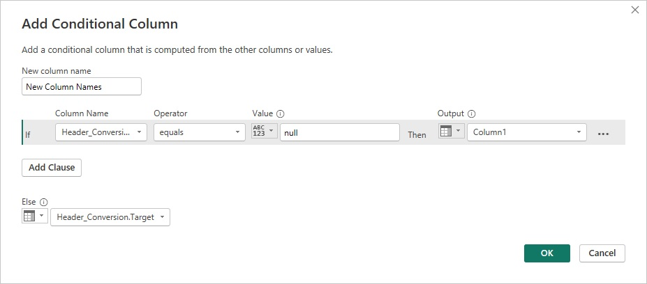

# Lab 4 - Combineren van afwijkende tabellen

*Vereisten*

Om het lab te kunnen starten is het van belang dat je toegang hebt tot Power BI desktop.

*Doel*

In dit vierde lab leer je Power Query in te zetten om data samen te voegen uit tabellen waarvan de opmaak verschilt.

## Opdracht 1 - Combineren van afwijkende tabellen, de reactieve aanpak

In het vorige lab heb je data samengevoegd uit meerdere bronnen. 
Een onuitgesproken aanname was echter dat al die bronnen dezelfde structuur hadden.
Bij het samenvoegen van data uit verschillende tabellen loop je soms tegen verschillen aan in de structuur. 
Zowel de kolomnamen als de volgorde kunnen afwijken.
Ook kan door handmatig ingrijpen of falen de structuur in de loop van de tijd veranderen.
In zo'n geval worden afwijkende kolommen in een samengevoegde query alleen gevuld vanuit één databron.
De rijen vanuit andere databronnen zullen leeg gelaten worden.
Het kan ook voorkomen dat kolommen uit de tweede databron worden genegeerd, waardoor data ontbreekt.
In dit lab leer je de oplossing voor deze issues.

1. Start een nieuw Power BI rapport, lees workbook **L4O5 - Conversion Table.xlsx** uit **Lab 4** in als Excel workbook en start Power Query Editor.

3. Creër een nieuwe query waarin beide queries worden samengevoegd (**Append Queries as New**).

> Als je de preview bekijkt van de nieuwe query zie je zowel de kolommen **StandardCost** uit **Accessories** als **Cost** uit **Bikes** met de resulterende lege waarden.
> Het is je misschien opgevallen dat je de categorie kwijt bent na de samenvoeging. 
> In een later lab bekijk je hoe je die context kunt behouden.

4. Selecteer de **Accessories** query en hernoem de kolom **StandardCost** tot "Cost". Controleer het gevolg in query **Append1**.

> In dit geval is handmatig bijwerken een snelle oplossing. 
> Some is dit echter niet haalbaar, bijvoorbeeld bij een groot aantal kolommen, of als je de opmaak van de aanlevering niet in de hand hebt. 
> En als je een folder als input gebruikt, dan werkt handmatig hernoemen van kolommen niet meer, zoals je straks ziet.

## Opdracht 2 - Demonstratie van het symptoom van ontbrekende waarden

1. Pak de bestanden uit de zip **L4O2 - Products.zip** uit in de folder "C:\Data\L4\L4O2 - Products\". Bekijk de bestanden en merk de verschillende kolomkoppen op.

2. Start een nieuw Power BI rapport en selecteer op de **Home** tab **Get Data** en selecteer onder de categorie **File** de bron **Folder**.

3. Navigeer naar de juiste folder met de bronbestanden voor **Lab 4**, klik op **Combine** en kies voor **Combine & transform Data**.

4. Selecteer in de **Combine File** dialoog die opent één van de opties in het dropdown menu **Sheet1** en klik op OK.

> De keuze die je maakt bepaalt de kolomnamen voor de gecombineerde query.

5. Scroll in het *Preview Query* paneel naar beneden tot de **Accessories** overgaan in de **Bikes**. Merk op dat de kolommen **Product**, **StandardCost** en **ListPrice** lege waarden bevatten.

> Om dit issue te verhelpen moet je aan de slag met de sample query. 

6. Selecteer in het *Queries* paneel de **Transform Sample File**. Deze bevat de file die je bij het inlezen van de folder als voorbeeld hebt geselecteerd en laat diens data correct zien.

> Bij het combineren van files uit een folder maakt Power Query verschillende artefacten aan: een query function, een sample query, een file query en een parameter.
> De transformatie voor elke file staat in de functie. Om deze transformatie te wijzigen kun je de sample file aanpassen. 
> Deze aanpassingen worden dan doorgevoerd in de functie en toegepast op alle files. 
> Als je files uit een folder combineert, zoek dan de **Transform Sample File** om aanpassingen op elke file te doen, voordat ze worden samengevoegd.

## Opdracht 3 - Aanname van gelijke volgorde en het generaliseren van de kolomkoppen

Om het issue van de ontbrekende waarden op te lossen mag je aannemen dat de kolomvolgorde in de files hetzelfde is.
Door deze aanname kun je generieke kolomkoppen gebruiken, zoals Column1, Column2 enz. en de kolomvolgorde gebruiken om de tabellen correct samen te voegen.

1. Selecteer in het *Queries* paneel de **Transform Sample File** en hernoem het tot "Products Sample".

2. Verwijder de laatste stap **Promoted Headers**.

> Door de generieke kolomnamen kun je de correcte data in de samengevoegde tabel zien.

3. Selecteer de query **L4O2 - Products** en merk de volgende foutmelding op: `Expression.Error: The column 'Product' of the table wasn't found.`

4. Verwijder de laatste stap: **Changed Type**. Nu heeft de samengevoegde tabel geen ontbrekende waarden meer.

5. Je kunt nu de eerste rij als kolomkoppen gebruiken (**Use First Row as Headers**).

> De kolomkoppen van de andere tabellen staan nog steeds als rijen in de data. Eerder heb je die eruit gefilterd, maar hadden ze dezelfde naam.
> Nu is dat niet het geval. Je kunt de rij met kolomkoppen eenvoudiger herkennen door voor het samenvoegen een index aan de data toe te voegen.

6. Selecteer de query **Products Sample**. Selecteer op de **Add Column** tab de transformatie **Index Column**. Voor elke file zal de rij met kolomkoppen de waarde 0 hebben in deze index.

7. Ga terug naar de query **L4O2 - Products** en filter de rijen met kolomkoppen uit de dataset.

8. Verwijder de eerste en laatste kolom. Maak de query robuuster door in de formule van deze **Removed Columns** stap de harde verwijzing naar `"L4O2 - Accessories.xlsx"` te vervangen door `Table.ColumnNames(#"Filtered Rows"){0}`.

> Je kunt nu de query laden naar het rapport om de analyse te starten.

## Opdracht 4 - Eenvoudige normalisatie d.m.v. Table.TransformColumnNames

Als je niet kunt aannemen dat de kolomvolgorde hetzelfde is voor al je bestanden, dan is normalisatie van kolomnamen een krachtige tool.
Het is in principe niet meer dan tekstmanipulatie, maar in veel gevallen is dat voldoende om formats van kolomnamen consistent te maken.
Omdat Power Query case sensitive is, kan het toepassen van lowercase, uppercase of capitalizatie een effectieve stap zijn.
Als je tabellen vaak veranderen en de kolomnamen van lowercase naar uppercase veranderen en vice versa, dan zal het uniformeren van de case afwijkingen beperken.

Om kolomnamen te bewerken heb je de M functie Table.TransformColumnNames tot je beschikking. 
Als de laatste stap in de Applied Steps bijvoorbeeld **Vorige stap** heet, dan kun je capitalisatie toepassen met de volgende formule:
`= Table.TransformColumnNames(#"Vorige stap", Text.Proper)`
En je kunt underscores door spaties vervangen:
`= Table.TransformColumnNames(#"Vorige stap", each Replacer.ReplaceText(_,"_"," "))`

In deze opdracht zul je beide formules gaan toepassen bij het samenvoegen van AdventureWorks Producttabellen.

1. Pak de bestanden uit de zip **L4O4 - Products.zip** uit in de folder "C:\Data\L4\L4O4 - Products\". 

> Deze bestanden lijken op de bestanden uit opdracht 2, met kleine verschillen. De kolomkoppen kunnen geuniformeerd worden door te capitaliseren en underscores te vervangen. Daarnaast zijn in **Bikes** de eerste twee kolommen omgewisseld.

2. Start een nieuw Power BI rapport en selecteer op de **Home** tab **Get Data** en selecteer onder de categorie **File** de bron **Folder**.

3. Navigeer naar de juiste folder met de bronbestanden voor **Lab 4**, klik op **Combine** en kies voor **Combine & transform Data**.

4. Selecteer in de **Combine File** dialoog die opent één van de opties in het dropdown menu **Sheet1** en klik op OK.

> Check dat de resulterende query inderdaad leidt onder het symptoom van ontbrekende waarden.

5. Selecteer de **Transform Sample File** en hernoem het tot "Products Sample". Klik dan op het Fx icoon in de *Formula bar*.

> Er wordt een nieuwe stap toegevoegd, **Custom1**, die de volgende formule laat zien: `= #"Promoted Headers"`. 
> Dit is de variabele die verwijst naar de output van de vorige stap, **Promoted Headers**.
> Omdat deze variabele de tabel met afwijkende kolomnamen teruggeeft, kun je de functie `Table.TransformColumnNames` erop toepassen met argument `Text.Lower` om kleine letters van de kolomnamen te maken.

6. Wijzig de formule in: `= Table.TransformColumnNames(#"Promoted Headers", Text.Lower)` en druk op Enter. Merk op dat de kolomnamen er nu in kleine letters staan. 

> Als kolomnamen beginnend met hoofdletters jouw voorkeur hebben, vervang `Text.Lower` dan door `Text.Proper`.
> Je kunt deze transformatie ook toepassen als de kolomnamen van jouw huidige datasets consistent zijn, om problemen in de toekomst te voorkomen.

7. Klik opnieuw op het Fx icoon in de *Formula bar* en wijzig de formule van stap **Custom2** naar `= Table.TransformColumnNames(#"Custom1", each Replacer.ReplaceText(_,"_"," "))`.

8. Klik op Enter en merk op dat de kolomnamen nu spaties bevatten in plaats van underscores. Ze zien er nu gebruiksvriendelijker uit.

9. Selecteer nu query **L4O4 - Products** en verwijder de laatste stap, **Changed Type**. De bestanden zijn nu correct samengevoegd en er zijn geen onverwachte ontbrekende waarden meer.

## Opdracht 5 - Transponeren met een conversietabel

Als eenvoudige tekstmanupulatie niet afdoende is om kolomnamen te consolideren, dan kun je gebruik maken van een conversietabel.
Deze tabel vertaalt de afwijkende kolomnamen naar de correcte vorm. 
Je kunt een voorbeeld bekijken van een conversietabel in **L4O5 - Conversion Table.xlsx**.
In dit excel workbook kun je klein beginnen en de conversies langzaam uitbreiden om alle issues te verhelpen.
De query in Power Query blijft hetzelfde en behoeft geen handmatige aanpassingen meer.
Aanvullen van de externe conversietabel en het verversen van het rapport is voldoende.

Om deze conversietabel te gebruiken om afwijkende kolomnamen te verbeteren gebruik je **Merge Queries**.
Dit stelt je in staat om meerdere queries aan elkaar te koppelen, aan de hand van overeenkomende waarden in gespecificeerde kolommen. 
Je zal tegen het einde van dit lab in staat zijn om aan de hand van Table.TransformColumnNames en custom M formules de kolomnamen te vervangen.
Dit vergt wat diepere kennis van M, vandaar dat je eerst drie andere UI-gedreven aanpakken zal uitwerken, die geen geavanceerde M kennis behoeven.

Ben je al comfortabel met M code, dan zal je de laatste opdracht waarschijnlijk de beste uitwerking vinden. 
Werk echter ook de overige opdrachten door om de voor- en nadelen te ondervinden.

1. Pak de bestanden uit de zip **L4O5 - Products.zip** uit in de folder "C:\Data\L4\L4O5 - Products\". 

2. Start een nieuw Power BI rapport en lees workbook **L4O5 - Bikes.xlsx** uit **Lab 4** in als Excel workbook (selecteer **Load**).

3. Rechtsklik op de query en zet **Enable load** uit. Klik nu op **Close & Apply**.

4. Importeer de product tabellen als folder uit **L4O5 - Products**.

5. Selecteer de **Transform Sample File** en hernoem het tot "Products Sample". Hernoem query **L4O5 - Products** tot "Appended Products" en klik op **Close & Apply**.

6. Sla het rapport nu vier keer op, als basis voor het vervolg van opdracht 5 en de volgende opdrachten 6, 7 en 8. 

> De eerste techniek voor normaliseren van kolomnamen is de **Transpose** transformatie op de **Transform** tab.
> Als je waarden van kolomnamen wilt manipuleren is dat makkelijker als ze verticaal in een kolom staan. Hier komt **Transpose** van pas.
> De originele kolomnamen worden echter niet in stand gehouden na de transformatie. 
> Je zal die eerst moeten terugzetten naar de eerste rij, voor het transponeren.

7. Open het eerste opgeslagen rapport en open de Power Query Editor. 

8. Selecteer de query **Products Sample** en verwijder de laatste stap, **Promoted Headers**. De headers staan nu in de eerste rij.

9. Selecteer op de **Transform** tab de transformatie **Transpose**. **Column1** bevat nu de te normaliseren kolomnamen.

> Je gaat nu de conversietabel opnemen in de getransponeerde tabel om de afwijkende kolomnamen aan te passen.

10. Selecteer op de **Home** tab de transactie **Merge Queries**. Selecteer in de dialoog die opent **Column1** onder **Products Sample** en selecteer in het dropdown menu **Header_Conversion**. Selecteer daaronder vervolgens kolom **Source**. Controleer dat de Join Kind op **Left Outer** staat en klik op OK.

> **Header_Conversion** is nu toegevoegd aan de **Product Sample** query met als waarden een tabelobject. 

11. Klik op de twee pijltjes in de kolomkop. Daarmee kun je een selectie maken uit het tabelobject. Verwijder het vinkje voor **Source** en klik op OK.

> Nieuwe kolom **Header_Conversion.Target** bevat nu waarden waar de originele kolommen afwijken en is leeg als de kolomnamen kloppen.
> Met een conditionele kolom kun je beiden samenvoegen.

12. Voeg een **Conditional Column** toe (tab **Add Column**) en configureer het als volgt:

 

13. Verwijder kolommen **Column1** en **Header_Conversion.Target**.

14. Verplaats de kolom **New Column Names** naar de eerste (meest linkse) plaats. Dit kan door drag & drop, maar bij een brede query is het handiger om op tab **Transform** onder het dropdown menu **Move** te kiezen voor **To Beginning**.

> Nu we de correcte kolomnamen in de eerste kolom hebben staan kun je het transponeren uit stap 9 weer omkeren en de eerste rij als kolomkoppen gebruiken.

15. **Transpose** de query en **Use First Row as Headers**.

16. Selecteer de query **Appended Products** en controleer het resultaat. Geeft het een foutmelding, verwijder dan de laatste stap, **Changed Type**.

> Deze methode werkt voor kleine datasets. Voor tabellen met meer dan 15.000 rijen kan het zorgen voor trage imports, hoog memory-gebruik of zelfs errors.
> Voor grotere sets heb je een andere aanpak nodig.

## Opdracht 6 - Unpivot, Merge en Pivot terug

Een betere methode om kolomnamen in een kolom te zetten en klaar te zetten voor de merge met de conversietabel is de **Unpivot** transformatie.

1. Start met het tweede opgeslagen rapport uit opdracht 4. Voeg een **Index Column** toe aan query **Products Sample**.

2. Rechtsklik op de kolomkop van kolom **Index** en selecteer **Unpivot other columns**.

> Power Query creëert een nieuwe tabel met drie kolommen: **Index**, **Attribute** en **Value**.
> De **Index** kolom helpt je later om de tabel in zijn originele staat te herstellen.
> De kolom **Attribute** bevat de kolomnamen en **Value** de originele waarden, die je gaat bewerken.

3. Hernoem de kolom **Attribute** tot **Column1**.

4. Merge de tabel met Header_Conversion, zoals beschreven in stap 10-14 van opdracht 5.

5. Selecteer de kolom **New Column Names** en selecteer op de **Transform** tab de transformatie **Pivot Column**.

6. Selecteer in de dialoog die opent **Values** als **Values Column** en klap de **Advanced options** open. Selecteer **Don't Aggregate** en klik op OK.

7. Verwijder de **Index** kolom.

8. Selecteer de query **Appended Products** en controleer het resultaat. Geeft het een foutmelding, verwijder dan de laatste stap, **Changed Type**.

> Hoewel deze techniek op grote datasets kan worden toegepast, kan de **Pivot** techniek die gebruikt wordt om de tabel weer terug te draaien veel geheugen kosten. 
> Power Query moet door de hele dataset gaan om unieke waarden in de kolom **Attribute** te zoeken en daar nieuwe kolommen van maken.
> Deze methode is daarom niet ideaal als je grote datasets hebt en tabellen wilt combineren op een geoptimaliseerde manier met een korte ververstijd.

## Opdracht 7 - Transponeren van alleen de kolomnamen

Een optimalere methode om kolomnamen te transformeren tot een kolom en voor te bereiden voor de merge met de conversietabel is om de kolomnamen apart te transponeren.
Deze techniek is eenvoudig uit te voeren om een aantal specifieke bestanden te combineren, maar toepassing op een folder is lastiger, aangezien dat leunt op custom functies.
Gebruik deze techniek alleen als de voorgaande technieken vanwege performanceproblemen geen optie zijn en als je het gebruik van M-technieken (volgende opdracht) wilt voorkomen.

1. Start met het derde opgeslagen rapport uit opdracht 4. Verwijder de laatste stap, **Promoted Headers**, in query **Products Sample**.

2. Rechtsklik op **Products Sample** in het *Queries* paneel en selecteer **Duplicate**. Selecteer dan op de **Home** tab onder **Keep Rows** de transformatie **Keep Top Rows**. Voer in de dialoog die opent de waarde "1" in en klik op OK.

> De transformaties die je uitvoert op de originele Sample file worden in de query functie uitgevoerd op alle bestanden in de folder. 
> Dit geldt echter niet voor het het duplicaat. Hiervoor moet je de nieuwe query nog verbinden met de transformatiestappen in de Sample query.
> Dat doe je aan het einde van deze opdracht.

3. Transponeer de rij naar een kolom en merge de tabel met Header_Conversion.

4. Voeg een **Index Column** toe. Dit garandeert dat de kolomvolgorde niet zal veranderen.

5. **Expand** de kolom **Header_Conversion** en selecteer alleen **Target**.

6. Voeg de **Conditional Column** toe, zoals beschreven in stap 12 van opdracht 5.

7. Controleer dat de kolom **Index** nog steeds gesorteerd staat. Zo niet, sorteer dan oplopend. 

8. Verwijder alle kolommen, behalve **New Column Names**. Transponeer de kolom terug naar een rij.

> De normalisatie is nu toegepast. Wat rest is het samenvoegen van de queries.

9. Selecteer de query **Products Sample**, selecteer op de **Home** tab onder **Remove Rows** de transformatie **Remove Top Rows**. Geef als waarde "1" mee om de eerste rij met afwijkende kolomnamen te verwijderen.

10. Selecteer in de **Home** tab de transformatie **Append Queries** en kies in de dialoog die opent **Product Sample (2)**.

> De kolomnamen staan nu onderaan de data. In de formule kunnen we dit verbeteren.

11. Wissel in de formule de twee argumenten om: `= Table.Combine({#"Products Sample (2)", #"Removed Top Rows"})`. Promoveer nu de eerste rij tot kolomkoppen en verwijder de laatste stap, **Changed Type**.

> Het verwijderen van de laatste stap is belangrijk, omdat de Size kolom in bestand Accessories alleen nummers bevat, waardoor Power Query het datatype interpreteert als Whole Number. 
> Voor andere bestanden zijn alfanumerieke Sizes echter valide waarden, wat zou leiden tot errors in de kolom **Size**. 

12. Selecteer de query **Appended Products** en controleer het resultaat. Geeft het een foutmelding, verwijder dan de laatste stap, **Changed Type**.

> Als je door de preview scrolt en bij **Bikes** aankomt, valt het op dat de waarden van kolommen **Name** en **Product Number** verwisseld zijn. 
> De normalisatie is dus niet correct uitgevoerd, maar wat is er gebeurt?
> Het goede nieuws is dat de query **Products Sample (2)** goed wordt uitgevoerd op één bestand. 
> Het slechte nieuws is dat die kolomnaamnormalisatie wordt hergebruikt voor alle bestanden in de folder.
> Als je de eerste stap in **Product Sample (2)** selecteert, dan kun je in de formule zien dat de excel wordt ingelezen uit de parameter **Parameter1**.
> Als je die parameter selecteert in het *Queries* paneel, dan zie je daar de waarde **Sample File**.
> Het selecteren van de query **Sample File** laat zien dat het nu naar het bestand van Accessories verwijst. 
> In dit bestand is de kolomvolgorde anders dan in het bestand met Bikes, vandaar dat de normalisatie niet correct verloopt. 
> Om dit te verhelpen moet je leren hoe je de logica uit **Product Sample (2)** kan hergebruiken voor alle bestanden in de folder.
> Je moet een manier vinden om er een herbruikbare query van te maken, die bestanden als parameter van **Product Sample** meekrijgt. 
> Om dit te doen kun je van **Product Sample (2)** een functie maken, die voor elk bestand in de folder kan worden aangeroepen.

13. Rechtsklik op query **Product Sample (2)** en selecteer **Create Function**. Geef het de naam "FnNormalizeFunctionNames".

> Deze functie kun je nu aanroepen binnen de **Products Sample** query in plaats van de query **Products Sample (2)**.

14. Selecteer de stap **Appended query** in query **Products Sample**. Vervang de verwijzing naar **Products Sample (2)** met de aanroep van de functie als volgt:

`= Table.Combine({FnNormalizeFunctionNames(Parameter1), #"Removed Top Rows"})`

> De functie ontvangt de inhoud van een excel workbook uit de folder als argument en geeft de genormaliseerde kolommen terug. 
> De tabel #"Removed Top Rows" is de laatste stap in **Products Sample** voor de append. 
> Terwijl Power Query itereert over de bestanden in de folder krijgt **Parameter1** steeds een nieuwe waarde.

15. Controleer in de query **Applied Products** of de kolomvolgorde van de **Bikes** nu wel correct wordt verwerkt.

## Table of Contents

1. [Lab 1 - Een eerste blik op Power Query](../Lab1/LabInstructies1.md)
2. [Lab 2 - Datapreparatie uitdagingen](../Lab2/LabInstructies2.md)
3. [Lab 3 - Data samenbrengen uit meerdere bronnen](../Lab3/LabInstructies3.md)
4. [Lab 4 - Combineren van afwijkende tabellen](../Lab4/LabInstructies4.md)
